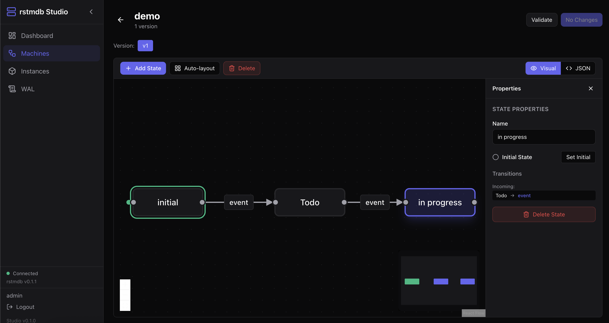

# rstmdb Studio

[](https://github.com/rstmdb/rstmdb-studio/actions/workflows/ci.yml)
[](https://hub.docker.com/r/rstmdb/rstmdb-studio)
[](https://hub.docker.com/r/rstmdb/rstmdb-studio)
[](LICENSE)

Web UI for managing [rstmdb](https://github.com/rstmdb/rstmdb) instances.



## Features

- Visual state machine builder with drag-and-drop canvas
- Guard condition builder for transitions
- Machine version management
- Instance inspection and state tracking
- WAL (Write-Ahead Log) explorer
- Session-based authentication with Argon2 password hashing

## Quick Start with Docker Compose

```bash
docker compose up --build
```

This starts three services:

- **rstmdb** — the database backend on port 7401
- **studio-init** — creates a default admin user (`admin`/`admin`)
- **studio** — the web UI at [http://localhost:8080](http://localhost:8080)

## Local Development

### Prerequisites

- Rust 1.85+
- Node.js 20+
- A running rstmdb server

### Backend

```bash
# Initialize admin user
cargo run -- init --admin-pass admin --data-dir ~/.rstmdb-studio

# Start the server
cargo run -- serve --config studio.yaml --rstmdb-addr 127.0.0.1:7401
```

### Frontend

```bash
cd frontend
npm install
npm run dev
```

The Vite dev server runs at `http://localhost:5173` and proxies API requests to the backend on port 8080.

### Build for Production

```bash
cd frontend && npm run build && cd ..
cargo build --release
```

The frontend is embedded into the binary via `rust-embed`.

## Configuration

Configuration is loaded from `studio.yaml` with environment variable overrides (prefixed with `STUDIO_`, use `__` for nested keys).

```yaml
server:
  host: "0.0.0.0"
  port: 8080

rstmdb:
  address: "127.0.0.1:7401"

auth:
  session_idle_timeout: "2h"
  session_max_lifetime: "24h"
  lockout_attempts: 10
  lockout_duration: "5m"

# data_dir: "~/.rstmdb-studio"
```

### Environment Variables

| Variable | Description |
|---|---|
| `STUDIO_HOST` | Server bind address |
| `STUDIO_PORT` | Server port |
| `RSTMDB_ADDR` | rstmdb server address |
| `RSTMDB_TOKEN` | rstmdb auth token |
| `STUDIO_DATA_DIR` | Data directory for auth storage |

## Project Structure

```
rstmdb-studio/
├── src/                  # Rust backend
│   ├── api/              # HTTP handlers
│   ├── auth/             # Authentication & password hashing
│   ├── config.rs         # Configuration management
│   ├── rstmdb/           # rstmdb client wrapper
│   └── main.rs           # CLI & server entrypoint
├── frontend/             # React frontend
│   ├── src/components/   # UI components
│   ├── src/pages/        # Route pages
│   └── src/lib/          # API client & utilities
├── Dockerfile            # Multi-stage build
├── docker-compose.yml    # Full stack setup
└── studio.yaml           # Default configuration
```

## License

[MIT](LICENSE)
